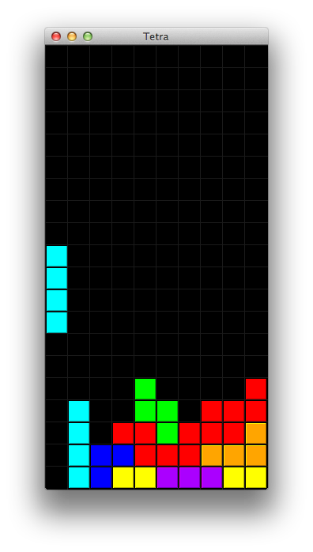

# Tetra
Tetris-klooni kurssille [ohjelmoinnin harjoitustyö](https://github.com/javaLabra/Javalabra2016-3).

Tetris on yhden pelaajan peli, jossa pyritään pinoamaan palikoita siten, että ne muodostavat täysiä vaakarivejä. Palikat tippuvat yksi kerrallaan pelialueen yläreunasta. Pelaajan tavoite on liikuttaa ja pyörittää pelattavissa oleva palikka mahdollisimman edulliseen asentoon ennen kuin se saavuttaa alla odottavan palikoiden pinon. Tetriksen pelialue on ruudukko, ja palikka siirtyy aina kokonaisin askelin pelialueen ruutujen välillä.

Tetriksessä on 7 erilaista palikkaa. Palikoita saadaan käännettyä erilaisiin asentoihin pyörittämällä niitä tasossa. Kullakin palikalla on 4 erilaista asentoa, mutta osa näistä voi olla keskenään samanlaisia. Erilaisia asentoja onkin siten palikasta riippuen 1, 2 tai 4. Pyörittäminen tapahtuu myötäpäivään tai vastapäivään, mutta aina 90 astetta kerrallaan. Yleensä palikkaa pyöritetään myötäpäivään.

Tetriksen palikat koostuvat neljästä yhden ruudun kokoisesta palasesta. Alkuperäinen nimi tetris on yhdistelmä sanoista tetra, joka tarkoittaa neljää, ja tennis. Tämän Tetris-kloonin nimeksi on valittu alkuperäisen nimen ensimmäinen kantasana: Tetra.

## Dokumentaatio

Katso [aihemäärittely ja luokkakaavio](dokumentointi/aiheenKuvausJaRakenne.md) sekä [tuntikirjanpito](dokumentointi/tuntikirjanpito.md).

## Käyttöliittymän luonnos

Käyttöliittymästä on tehty osittainen alustava luonnos. Luonnos on tehty testausta ajatellen siten, että palikoida voi liikutella ja lukita matriisiin. Pelistä kuitenkin puuttuu vielä kokonaan varsinainen pelisilmukka, joka pyörittäisi peliä.

Nykyistä palikkaa liikutellaan nuolinäppäimillä ja pyöritetään näppäimillä Z ja X. Välilyönti lukitsee nykyisen palikan paikoilleen ja arpoo uuden. Mikään ei estä lukitsemasta palikkaa siten, että se jää roikkumaan ilmaan.

