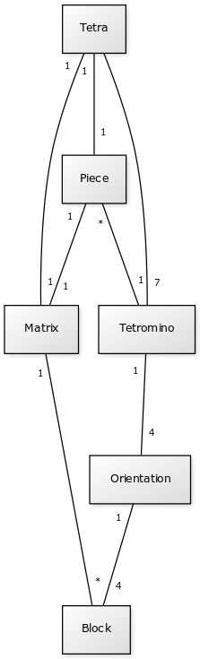
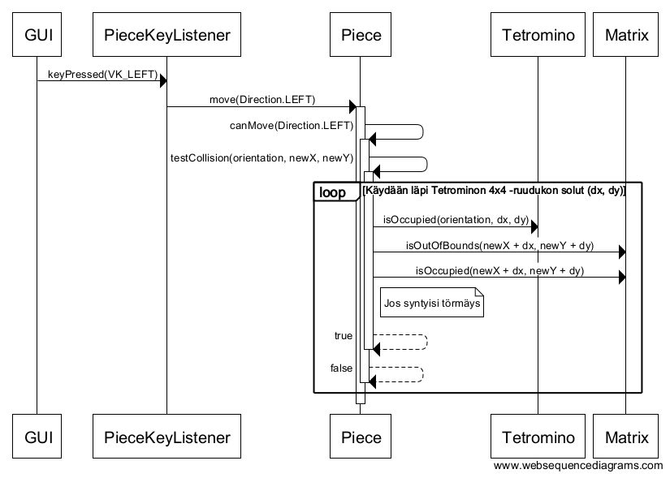

# Aiheen kuvaus ja rakenne

## Aihemäärittely

**Aihe:** Tetris

Tetris on yhden pelaajan peli, jossa pyritään pinoamaan palikoita siten, että ne muodostavat täysiä vaakarivejä. Palikat tippuvat yksi kerrallaan pelialueen yläreunasta. Pelaajan tavoite on liikuttaa ja pyörittää pelattavissa oleva palikka mahdollisimman edulliseen asentoon ennen kuin se saavuttaa alla odottavan palikoiden pinon. Tetriksen pelialue on ruudukko, ja palikka siirtyy aina kokonaisin askelin pelialueen ruutujen välillä.

Tetriksessä on 7 erilaista palikkaa. Palikoita saadaan käännettyä erilaisiin asentoihin pyörittämällä niitä tasossa. Kullakin palikalla on 4 erilaista asentoa, mutta osa näistä voi olla keskenään samanlaisia. Erilaisia asentoja onkin siten palikasta riippuen 1, 2 tai 4. Pyörittäminen tapahtuu myötäpäivään tai vastapäivään, mutta aina 90 astetta kerrallaan. Yleensä palikkaa pyöritetään myötäpäivään.

Tetriksen palikat koostuvat neljästä yhden ruudun kokoisesta palasesta. Alkuperäinen nimi tetris on yhdistelmä sanoista tetra, joka tarkoittaa neljää, ja tennis. Tämän Tetris-kloonin nimeksi on valittu alkuperäisen nimen ensimmäinen kantasana: Tetra.

**Käyttäjät:** Pelaaja

**Pelaajan toiminnot pelin aikana:**

Pelin aika pelaajalla on käytettävissä seuraavat pelilogiikkaan liittyvät toiminnot.

* *Palikan siirto sivusuunnassa*
  * Pelaaja voi siirtää sillä hetkellä pelattavissa olevaa palikkaa sivusuunnassa.
  * Palikkaa pitää voida liikuttaa melko nopeasti, jotta pelaaja ehtii reagoida erilaisiin pelitilanteisiin.
* *Palikan pyöritys*
  * Pelaaja voi pyörittää sillä hetkellä pelattavissa olevaa palikkaa myötäpäivään tai vastapäivään.
* *Palikan tippumisen nopeuttaminen (soft drop)*
  * Pelaaja voi käskeä palikkaa tippumaan tavallista nopeammin.
  * Nopeuttamisesta saa pisteitä, koska se lisää pelin vaativuutta.
* *Palikan tiputtaminen suoraan ala-asentoon (hard drop)*
  * Välittömästä tiputtamisesta saa pisteitä, koska se lisää pelin vaativuutta.
  * Välitön tiputtaminen antaa enemmän pisteitä kuin tippumisen nopeuttaminen.

Seuraavat toiminnot ovat olennainen osa pelilogiikkaa, mutta pelaaja ei kontrolloi niiden suorittamista.

* *Palikkaa tippuu vakionopeudella niin kauan kuin se on pelattavissa*
  * Palikka siirtyy vakionopeudella kohti ruudun alareunaa niin kauan kuin se on pelattavissa.
  * Tippumisnopeus kiihtyy pelin kuluessa. Jokainen täytetty rivi kasvattaa tippumisnopeutta hieman.
* *Palikkaa saavuttaa ala-asennon, jonka jälkeen se ei enää ole pelattavissa*
  * Palikka saavuttaa ala-asennon, kun se törmää toiseen sen alla olevaan palikkaan tai pelialueen alareunaan.
  * Tämän jälkeen palikka ei enää liiku eikä ole pelaajan liikuteltavissa.
  * Jos pelialueelle muodostui yksi tai useampi täysi vaakarivi
    * Täydet vaakarivit poistuvat pelialueelta. Yhtä aikaa voi täyttyä 1-4 riviä.
    * Pelaaja saa pisteitä täyttyneiden rivien lukumäärän mukaan. Parhaat pisteet saa neljällä samanaikaisella rivillä.
  * Jos yksikään vaakarivi ei täyttynyt kokonaan
    * Viimeisin pelattu palikka jää paikalleen.
  * Peli arpoo uuden palikan, ja lähettää sen liikkeelle pelialueen yläreunasta.
* *Peli päättyy, kun palikoiden pino saavuttaa pelialueen yläreunan*
  * Pelin päätyttyä näytetään muutamia tilastotietoja, kuten kokonaispisteet, tuhotut rivit ja pelin kesto.
  * Jos pistemäärä oikeuttaa sijoitukseen pistelistalla, kysytään listalle talletettava nimi.
  * Pelaaja voi aloittaa uuden pelin, siirtyä valikoihin tai poistua ohjelmasta.

Pelin aika pelaajalla on käytettävissä myös seuraavat toiminnot, jotka eivät liity pelilogiikkaan.

* *Pause*
* *Pelin lopettaminen ja valikoihin siirtyminen*

**Pelaajan toiminnot, silloin kun peli ei ole käynnissä (valikot):**

* *Uuden pelin aloitus*
* *Asetukset*
* *Pistelista (high score table)*
* *Ohjelman sulkeminen*

**Aiheen laajennusmahdollisuudet:**

Seuraavassa on joitakin ajatuksia siitä, miten aihetta olisi mahdollista laajentaa ajan niin salliessa.

* *Väriteeman valinta (grafiikoiden valinta)*
* *Haamupalikka, joka näyttää tulevan loppuasennon (ghost piece)*
* *Pelitilanteen tallennus ja aikaisemmin tallennetun pelin jatkaminen*
* *Pistelaskun jatkokehitys (esimerkiksi T Spin)*
* *Kootut tilastotiedot kaikista pelatuista peleistä*

## Määrittelyvaiheen luokkakaavio



## Sekvenssikaaviot

Ensimmäiseksi kuvataan tapaus, jossa käyttäjä ohjaa pelattavaa palikkaa sivusuunnassa. Tässä tapauksessa käyttäjä on ohjannut palikkaa siirtymään vasemmalle. Tarkoitus on havainnollistaa, miten luokat Piece, Tetromino ja Matrix tutkivat yhdessä, onko käyttäjän pyytämä siirto mahdollinen. Ongelman keskiössä on palikan metodi ```Piece.checkCollision```. Tämän metodin avulla voidaan tunnistaa muutkin palikan liikkumista rajoittavat tapaukset. Koodin toiminnan kannalta on mielenkiintoisempaa tarkastella sellaista tapausta, jossa syntyy törmäys. Tässä tarkastellaan siis sellaista tilannetta, jossa siirtyminen ei ole mahdollista. Palikan siirtymistä voivat rajoittaa joko pelialueen reunat tai matriisiin kertyneet palaset.



