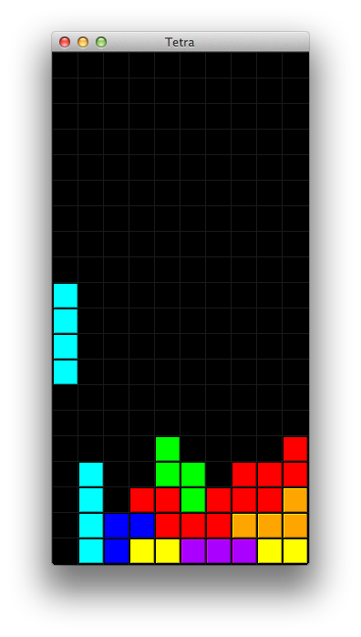

# Käyttöohje

Pelin tavoite on muodostaa täysiä vaakarivejä pinoamalla palikoita sopivasti päällekkäin. Uuden palikat ilmestyvät pelialueelle sen yläreunasta yksi kerrallaan. Tippuvaa palikkaa voi ohjata ja kiertää mahdollisimman edulliseen asentoon, kunnes se saavuttaa pelialueen alareunan, tai törmää pelialueelle lukittuneeseen palaseen. Törmäyksen jälkeen palikka lukittuu paikoilleen, ja pelialueen yläreunasta vapautuu uusi palikka pelattavaksi.

Täydet vaakarivit poistuvat pelialueelta sitä mukaa, kun pelaaja saa niitä muodostettua. Yhdellä palikalla on mahdollista täydentää 1-4 täyttä vaakariviä. Täydet neljä riviä on tosin mahdollista saavuttaa vain I-kirjaimen muotoisella palikalla. Alla olevassa kuvassa nähdään tilanne, jossa on mahdollisuus puhdistaa 2 riviä kerrallaan.

Peli nopeutuu hieman jokaista täytettyä riviä kohden. Pelin nopeutuessa pelialueella vapaana oleva tila alkaa yleensä käydä vähiin ennemmin tai myöhemmin. Poistuvat rivit vapauttavat pelialueelle lisää tilaa, mutta samalla pelin nopeutuminen vaikeuttaa peliä jatkuvasti. Peli päättyy, kun lukittuneiden palasten pino saavuttaa pelialueen yläreunan. Tarkalleen ottaen peli päättyy, kun ilmestyvä palikka ei enää mahdu pelialueelle.

Pelattavaa palikkaa ohjataan käyttämällä nuolinäppäimiä ja välilyöntiä. Nuolinäppäimet vasemmalle ja oikealle siirtävät pelattavaa palikkaa sivusuunnassa. Välilyönti puolestaan tiputtaa palikan suoraan ala-asentoon. Toinen vaihtoehto pelin vauhdittamiselle on palikan tippumisen nopeuttaminen painamalla nuolinäppäintä alas. Tippumista voi nopeuttaa juuri sen aikaa kuin on tarve: nopeus siis palaa ennalleen, kun nuolinäppäin vapautetaan. Edellisten lisäksi palikkaa kierretään painamalla nuolinäppäintä ylös. Kiertoihin voi käyttää myös näppäimiä Z ja X, jos haluaa hyödyntää kiertoja sekä vasta- että myötäpäivään. Muuten kierto tapahtuu aina myötäpäivään. Nämä näppäinkomennot on koottu myös alla olevaan taulukkoon.

| Toiminto              | Näppäin          |
| :-------------------- | :--------------- |
| Siirto vasemmalle     | VASEN nuoli      |
| Siirto oikealle       | OIKEA nuoli      |
| Välitön tiputus       | Välilyönti       |
| Nopeutettu tiputus    | Nuoli ALAS       |
| Kierto myötäpäivään   | Nuoli YLÖS tai X |
| Kierto vastapäivään   | Z                |

Pelin tavoite on tyhjentää mahdollisimman monta täyttä vaakariviä. Täysien rivien määrän näkee pelin päätyttyä. Tässä vaiheessa tarjotaan myös mahdollisuutta aloittaa uusi peli.

